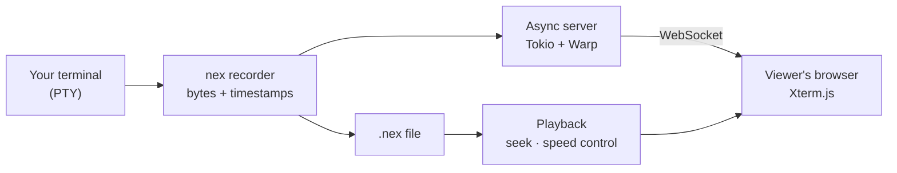

# Nex

Record your terminal, replay it, or stream it live to anyone with a browser. Nex is a Rust tool that captures terminal sessions into a compact `.nex` file, and can share a live terminal across the internet with playback rendered by Xterm.js.

**Live demo:** <https://nex-terminal.netlify.app>

Screen recordings of terminals are the wrong tool: they are enormous, blurry, and you cannot copy text out of them. A terminal session is really just a stream of bytes and timestamps, so that is what Nex stores.

## How it works



Recording wraps your shell in a pseudo-terminal and logs output with timing information. Sharing pipes the same stream over a WebSocket, so a viewer's browser renders your terminal live, as text — selectable, copyable, and a fraction of the size of a video.

## Usage

```bash
cargo build --release

nex start -o demo.nex          # start recording (default: recording.nex)
nex stop                       # stop the current recording
nex play demo.nex              # replay in your terminal (--show-commands for command markers)
nex inspect demo.nex           # examine a recording's contents
nex csv demo.nex               # export the session as CSV
nex json demo.nex              # export the session as JSON

nex serve 8080 --web           # host a collaborative session with a web UI
nex catch <host> 8080          # join someone's session from another terminal
```

`serve --web` exposes an HTTP + WebSocket interface on the same port, so a viewer needs nothing but a browser; `catch` joins from another terminal. Playback in the browser supports seeking and speed control, which video-based recordings make painful and plain-text logs make impossible.

## Why not asciinema?

Asciinema is excellent, and Nex is deliberately in its lineage. Building my own taught me the actual mechanics — PTY handling, timing capture, escape-sequence passthrough, async fan-out to multiple viewers — and gave me a self-hostable live-sharing mode with no third-party service in the loop.

## Honest limitations

- The `.nex` format is my own; there is no converter to or from asciicast yet
- Live sharing trusts the link — anyone with the URL can watch; there is no authentication layer at present
- Interactive input from viewers is intentionally not supported: it is a window, not a remote shell

## Stack

Rust · Tokio · Warp · WebSockets · Xterm.js

---

Built by [Aryan S Rao](https://github.com/aryansrao). Issues and pull requests are welcome.
